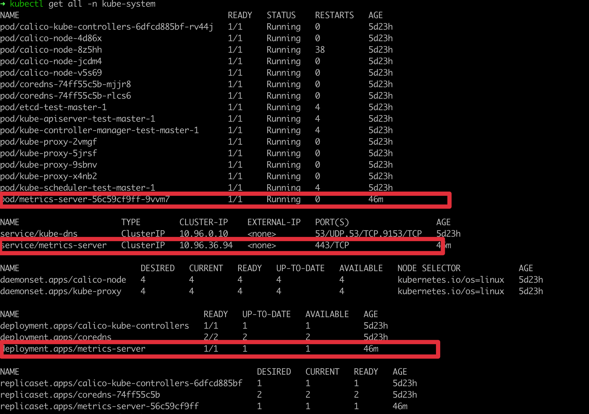

# Metric server pro kubernetes cluster

## 1. Info
Informace o vyuziti prostredku jako je CPU(cores), CPU%, Memory(bytes) a MEMORY%

Release metrics-severu najdete zde [metrics-server release](https://github.com/kubernetes-sigs/metrics-server/releases).

# 2. Pouzita verze
`v0.4.1`

v `metrics-server.yaml` je pouzita v __Deployment__ sekci image: `k8s.gcr.io/metrics-server/metrics-server:v0.4.1`

# 3. Instalace

## 3.1. Informace k instalaci

Moje instalace ma nastaveny argument `- --kubelet-insecure-tls` protoze nepouzivam komunikaci mezi nodes certifikaty. Tak jsem tento parametr musel pouzit, takze pokud mate certifikaty tak muzete defaultni verzi z [github repo metrics-server](https://github.com/kubernetes-sigs/metrics-server).

### 3.2. Instalace bez certifikatu
```
kubectl apply -f metrics-server.yaml
```

### 3.3. Instalace s cetifikaty
Vychazim z [github repo metrics-server](https://github.com/kubernetes-sigs/metrics-server)
```
kubectl apply -f https://github.com/kubernetes-sigs/metrics-server/releases/latest/download/components.yaml
```
# 4. Overeni instalace metrics-server
## 4.1. Otestovani nasazeni metrics-server
Instalace se provadi do namespace clusteru ktery se jmenuje `kube-system` overte ze mate
```
kubectl get all -n kube-system
```
a meli byste vydet tento vysledek
* pod
* service
* deployment



## 4.2. Metrics vysledek
```
kubectl top nodes
```

```
kubectl top pods
```

```
kubectl top pods -n kube-system
```

# 5. Reseni problemu s instalaci

```
kubectl get all -n kube-system
```

Pokud vam bude prikaz `kubectl top pods` vracet nejakou chybu je potreba zkontrolovat
1. Jestli dobehl deployment pokud zobrazuje `deployment.apps/metrics-server` READY 1/1 pokud tam je 0/1, tak je potreba se podivat co se deje 

```
kubectl descibe deployment metrics-server
```

2. Zkontrolovat jestli bezi pod metrics-serveru `pod/metrics-server-xxxx` pokud bezi RUNNING a READY je 1/1. 
Kazdpodadne jestli vsechno vypada ze je dobre a vse bezi je potreba se podivat do logu podu `pod/metrics-server-xxxx`

``` kubectl logs metrics-server-xxxx`

A v tomto logu se dovite vsechno proc container nenastartoval.